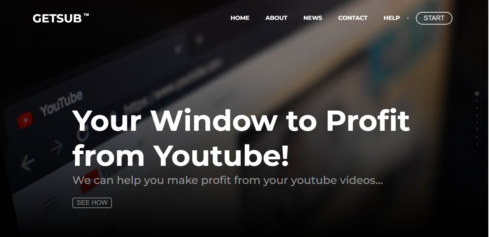
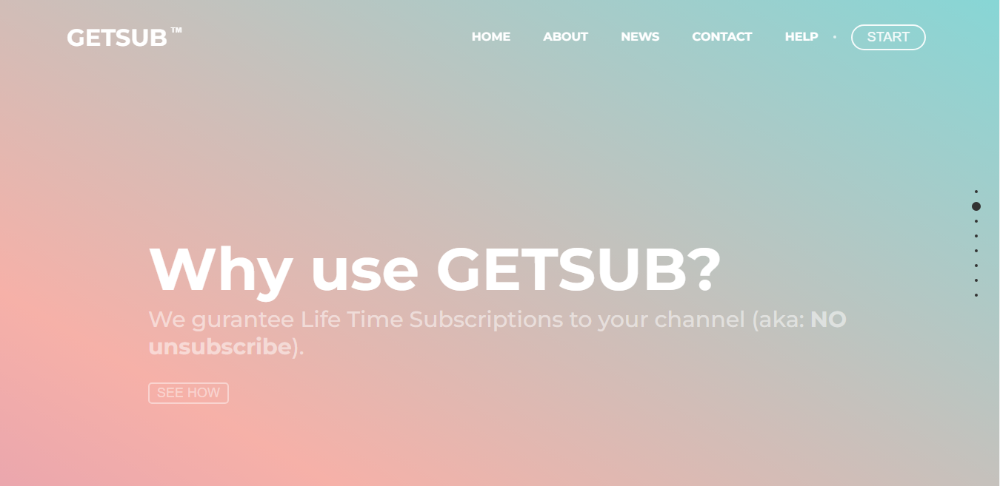

# GetSub

> GetSub Web App helps aspiring new youtubers get more subscriptions by interchanging subscriptions. Ui developed using **HTML5** & **CSS3** & **JS/ES6**.

## A Screenshot of the Homepage

## A Demo for the App

- [Demo](https://omarramoun.github.io/GetSub/)

## Built With

- Languages: _**HTML5/Semantics, CSS3/SASS, JS/ES6**_
- Technologies used: _**GIT, GITHUB, LINTERS**_

## Features

- Based on CSS
- SVG icons
- Nice and Clean Design
- Detailed documentation
- CSS3 Animations
- Sticky Navigation
- Fully Responsive to all devices
- Cross browser compatible
- SEO Compatible

## Authors

👤 **Ramoun**

- **GitHub**: 
- **Twitter**: 
- **LinkdIn**: 
- **Website**: 

## 🤝 Contributing

Contributions, issues, and feature requests are welcome!

Feel free to check the [issues page](../../issues).

## Show your support

Give a ⭐️ if you like this project!
